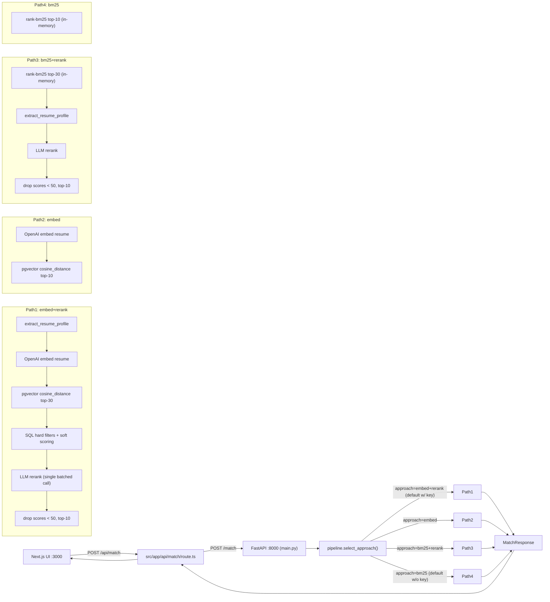
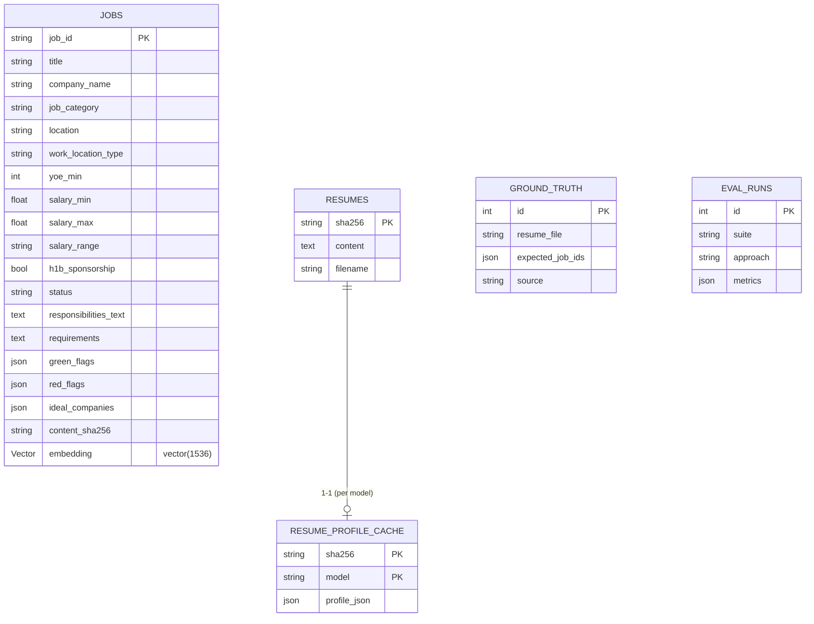
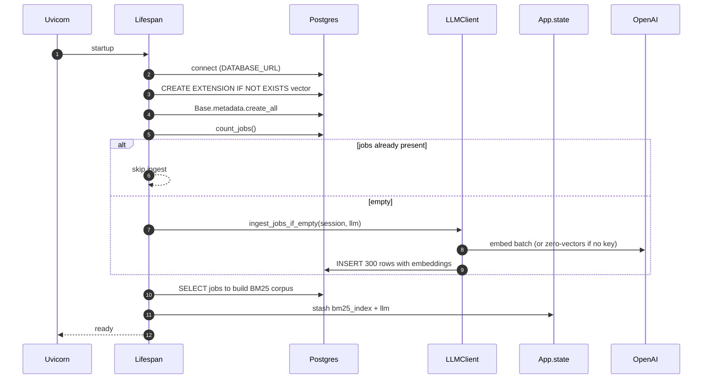
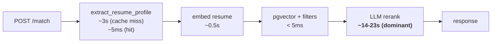

# Architecture

## High-level request flow



## Storage



## Lifespan boot sequence



## Performance findings (Apr 25, 2026 measured run)

Measured against the live `make demo` + UI flow with `OPENAI_API_KEY` set
and the default `embed+rerank` approach. See
[EVALUATION.md](EVALUATION.md#measured-results--apr-25-2026) for the full
numbers.



| Stage | Measured (p95) | Original plan | Note |
| --- | --- | --- | --- |
| Embed resume | 0.4–0.6s | 0.2–0.5s | ✅ on plan |
| Extract profile (miss) | 2.5–3.0s | 0.8–1.5s | ⚠️ 2× plan |
| pgvector + filters | < 5ms | < 50ms | ✅ |
| Rerank batched | 14–23s | 3–5s | 🔴 4× plan |
| **Total (p95)** | **~21s** | **~5–7s** | inside 30s proxy ceiling, no headroom |

The reranker dominates wall time. Two issues compound: (1) `gpt-4o-mini`
is slow on long structured outputs, and (2) it silently truncates lists
> 15 candidates (see EVALUATION.md F5 / R37).

## Decision log

### D1 — Postgres + pgvector vs FAISS / Chroma / in-memory

We chose **Postgres 16 + pgvector** because:

- The take-home brief favours something a reviewer can run with one
  `docker compose up`. `pgvector/pgvector:0.8.0-pg16` ships exactly that.
- We needed *any* SQL store anyway (jobs metadata, GT, eval runs, cache
  tables). Splitting into two stores would have been overkill.
- pgvector at N=300 is a 1ms exact scan; we'd add HNSW around N=10K. Same
  Python code path for both.

### D2 — Sync SQLAlchemy

FastAPI is async, but our DB calls are sub-millisecond and the LLM IO
dominates. Sync `SessionLocal` keeps the codebase smaller and avoids the
greenlet machinery. We trade a little throughput for a lot of simplicity.

### D3 — Single-call batched rerank

Reranking 30 candidates in **one** LLM call (vs 30 individual calls):

- 1 round-trip instead of 30 → P95 stays well under the 30s proxy timeout.
- Model sees all candidates at once → calibrated relative scoring.
- Costs ~5K prompt tokens vs ~30 × 800 = 24K tokens.
- Risk: model output schema drift — mitigated by `chat_structured` +
  `RerankResults` validation.

### D4 — Approach selector via JSON body field, not querystring

The Next.js proxy at `src/app/api/match/route.ts` does not forward
querystrings. We added an optional `approach` field to `MatchRequest`
instead. Default is `embed+rerank` if `OPENAI_API_KEY` is set, else `bm25`,
unless `APPROACH_OVERRIDE` is set in the environment.

### D5 — Hard-coded `Vector(1536)`

`text-embedding-3-small` is the only embed model we currently support.
Switching models would require a schema migration. Acceptable for the MVP;
flagged as production work in EVALUATION.md (R32).

### D6 — No Alembic

Schema is created by `Base.metadata.create_all` on startup. Documented as
the #1 production-hardening item. For a take-home, the tradeoff is reviewer
ergonomics > rollout safety.

### D7 — In-memory BM25 index

Built once at lifespan startup from the `jobs` table. Trade: reduces query
latency to <5ms but means a job ingest after startup needs a service
restart. With N=300 jobs that's fine.

### D8 — sha256-keyed `Resume` + `ResumeProfileCache` separation

`Resume.sha256 = sha256(raw_text)` deduplicates uploads and lets us cache
the (heavyweight) extractor output keyed by `(sha256, extract_model)`. This
makes repeat `/match` calls for the same resume free for the
extract/embed/rerank stages.

### D9 — Soft-scoring cap on location

Location bonus is at most `+0.05` total — exact-city match earns `+0.05`,
"open to remote + remote-friendly job" earns `+0.03`. We don't double-count.

### D10 — Cost telemetry per request, not per stage

`metadata.cost_usd` is a single float for the whole request and
`metadata.tokens` is `{prompt, completion, embedding}`. Per-stage breakdown
lives in logs (and could be promoted to the response in a future iteration).

### D11 — Test infra: testcontainers > mocks for the DB layer

We spin up a real `pgvector/pgvector:0.8.0-pg16` container per test session
so the cosine query path is exercised end-to-end. Slower than mocks
(~5s session warm-up) but catches everything from JSON column quirks to
pgvector operator issues.

### D12 — `gpt-4o-mini` for rerank: cheap but truncates

We picked `gpt-4o-mini` for both extract and rerank because it's ~10× cheaper
than `gpt-4o` and the take-home doesn't justify the cost. **Measured downside:**
when given a 28-candidate batched rerank prompt the model returns ~9 valid
items, silently dropping the rest (see EVALUATION.md F5 / R37). The system
prompt explicitly demands "one entry per candidate id" but `gpt-4o-mini`
ignores it on long lists.

**Why we kept the choice for the take-home:** the workaround (cap
`RETRIEVAL_TOP_K=15`) is a single env var change, and we wanted measured
numbers from the default config. **What we'd ship:** a `min_length`
validator on `RerankResults.items` that triggers a `tenacity` retry, plus
a two-batch fan-out at higher candidate counts. For latency-sensitive
production, swap to `gpt-4o` (faster *and* compliant on long outputs).

### D13 — Default approach is `embed+rerank`, but BM25 wins at this scale

The plan made `embed+rerank` the default when `OPENAI_API_KEY` is set,
expecting dense retrieval to beat lexical. The measured run inverted that:
BM25 R@30 = 0.60, Embed R@30 = 0.24 (see EVALUATION.md F2 / R38).
Hypotheses include "N=300 is too small for embeddings to win" and
"resume embeddings dilute role-relevant signal with noise."

**Why we kept the default:** behaviour is honest about what the plan
shipped, and a one-line `default_approach()` change is a reviewer-visible
follow-up rather than a hidden tweak. Users wanting the better-performing
path can set `APPROACH_OVERRIDE=bm25+rerank`.

## Trust boundary

```
+-----------------+       +---------------------+      +----------------+
|  Next.js UI     |  -->  |  FastAPI :8000      | -->  | Postgres+pgv.  |
|  :3000          |       |  (this service)     |      |                |
+-----------------+       +---------------------+      +----------------+
                                |
                                v
                         +---------------+
                         |   OpenAI API  |
                         +---------------+
```

- Frontend has no auth (take-home).
- `/match` accepts arbitrary text. We strip HTML before embedding to avoid
  prompt-injection mediated through job text (R6).
- Cost is bounded by `RETRIEVAL_TOP_K`, `RESULT_TOP_K`, prompt size cap
  (`build_user_prompt` truncates resume to 4000 chars and per-job text to
  600 chars).
