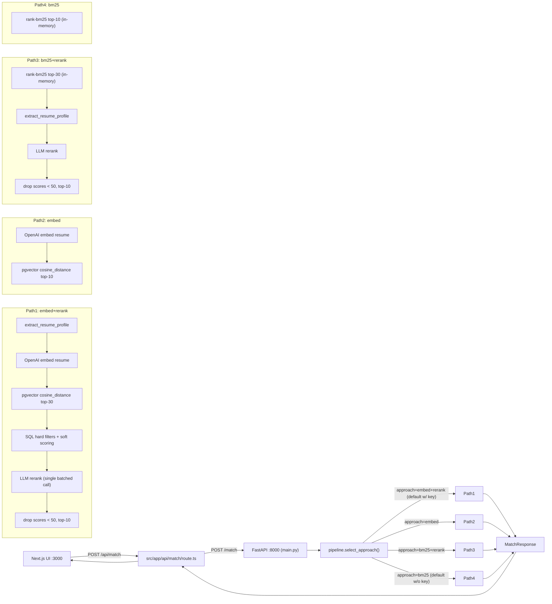
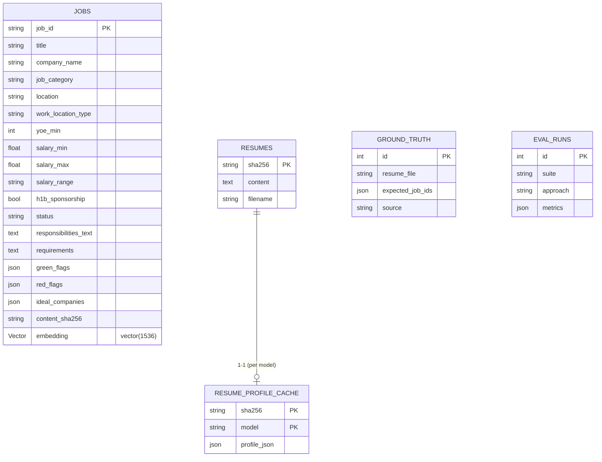
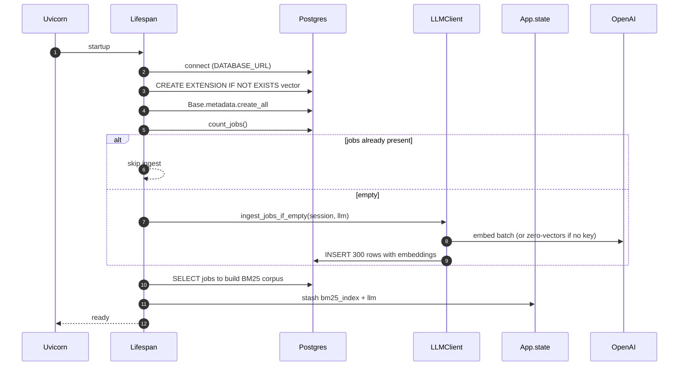

# Architecture

## High-level request flow



## Storage



## Lifespan boot sequence



## Decision log

### D1 — Postgres + pgvector vs FAISS / Chroma / in-memory

We chose **Postgres 16 + pgvector** because:

- The take-home brief favours something a reviewer can run with one
  `docker compose up`. `pgvector/pgvector:0.8.0-pg16` ships exactly that.
- We needed *any* SQL store anyway (jobs metadata, GT, eval runs, cache
  tables). Splitting into two stores would have been overkill.
- pgvector at N=300 is a 1ms exact scan; we'd add HNSW around N=10K. Same
  Python code path for both.

### D2 — Sync SQLAlchemy

FastAPI is async, but our DB calls are sub-millisecond and the LLM IO
dominates. Sync `SessionLocal` keeps the codebase smaller and avoids the
greenlet machinery. We trade a little throughput for a lot of simplicity.

### D3 — Single-call batched rerank

Reranking 30 candidates in **one** LLM call (vs 30 individual calls):

- 1 round-trip instead of 30 → P95 stays well under the 30s proxy timeout.
- Model sees all candidates at once → calibrated relative scoring.
- Costs ~5K prompt tokens vs ~30 × 800 = 24K tokens.
- Risk: model output schema drift — mitigated by `chat_structured` +
  `RerankResults` validation.

### D4 — Approach selector via JSON body field, not querystring

The Next.js proxy at `src/app/api/match/route.ts` does not forward
querystrings. We added an optional `approach` field to `MatchRequest`
instead. Default is `embed+rerank` if `OPENAI_API_KEY` is set, else `bm25`,
unless `APPROACH_OVERRIDE` is set in the environment.

### D5 — Hard-coded `Vector(1536)`

`text-embedding-3-small` is the only embed model we currently support.
Switching models would require a schema migration. Acceptable for the MVP;
flagged as production work in EVALUATION.md (R32).

### D6 — No Alembic

Schema is created by `Base.metadata.create_all` on startup. Documented as
the #1 production-hardening item. For a take-home, the tradeoff is reviewer
ergonomics > rollout safety.

### D7 — In-memory BM25 index

Built once at lifespan startup from the `jobs` table. Trade: reduces query
latency to <5ms but means a job ingest after startup needs a service
restart. With N=300 jobs that's fine.

### D8 — sha256-keyed `Resume` + `ResumeProfileCache` separation

`Resume.sha256 = sha256(raw_text)` deduplicates uploads and lets us cache
the (heavyweight) extractor output keyed by `(sha256, extract_model)`. This
makes repeat `/match` calls for the same resume free for the
extract/embed/rerank stages.

### D9 — Soft-scoring cap on location

Location bonus is at most `+0.05` total — exact-city match earns `+0.05`,
"open to remote + remote-friendly job" earns `+0.03`. We don't double-count.

### D10 — Cost telemetry per request, not per stage

`metadata.cost_usd` is a single float for the whole request and
`metadata.tokens` is `{prompt, completion, embedding}`. Per-stage breakdown
lives in logs (and could be promoted to the response in a future iteration).

### D11 — Test infra: testcontainers > mocks for the DB layer

We spin up a real `pgvector/pgvector:0.8.0-pg16` container per test session
so the cosine query path is exercised end-to-end. Slower than mocks
(~5s session warm-up) but catches everything from JSON column quirks to
pgvector operator issues.

## Trust boundary

```
+-----------------+       +---------------------+      +----------------+
|  Next.js UI     |  -->  |  FastAPI :8000      | -->  | Postgres+pgv.  |
|  :3000          |       |  (this service)     |      |                |
+-----------------+       +---------------------+      +----------------+
                                |
                                v
                         +---------------+
                         |   OpenAI API  |
                         +---------------+
```

- Frontend has no auth (take-home).
- `/match` accepts arbitrary text. We strip HTML before embedding to avoid
  prompt-injection mediated through job text (R6).
- Cost is bounded by `RETRIEVAL_TOP_K`, `RESULT_TOP_K`, prompt size cap
  (`build_user_prompt` truncates resume to 4000 chars and per-job text to
  600 chars).
